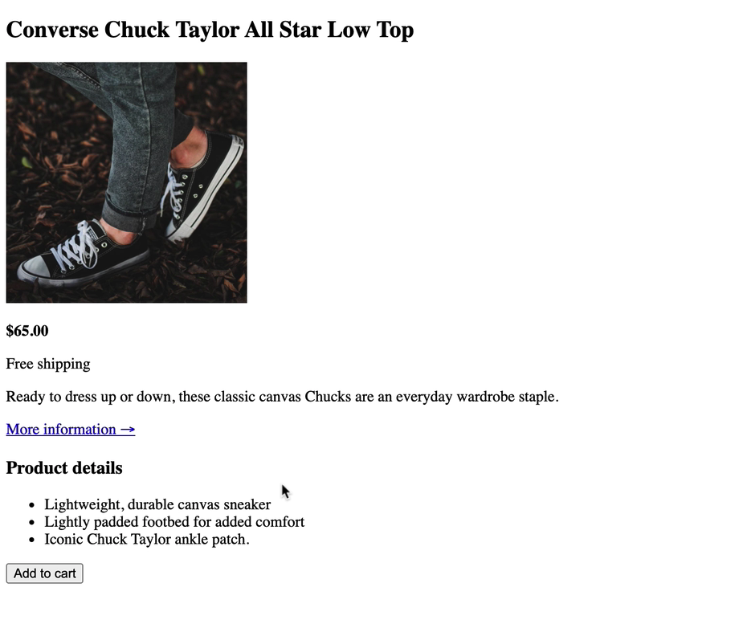

# This is challenge #1.

## Learn about HTML tags

The goal with this HTML challenges is to try to use different HTML tags and try to build this small website for Converse All Star shoe.

## Task to solve
Here is an overview of how the website should look. Remember that you don't have to match exactly the same color and font-size but try your best.

## Files overview 
This repository includes following files:

* index.html - This file is the first HTML file you create as you’re building a website. HTML ( HyperText Markup Language) can be seen as block elements that helps to structure your website. The index.html page is the default page a website visitor sees if no other page is specified.

* css - (Cascading Style Sheet) is an folder in the root directory which typically contains the style.css file.

* style.css - This file contains all styling and is used to describe the presentation of a document written in HTML. CSS describes how HTML elements should be rendered on screen, on paper, in speech, or on other media.

* img - ( an abbreviation for image) is an folder in the root directory which typically contains all images that will be applied on a website.

## The HTML `<DOCTYPE>` declaration

### Examples

`<!DOCTYPE html>` 
All **HTML** documents must start with a `<!DOCTYPE>` declaration. 
The declaration is not an **HTML** tag. It is an "information" to the browser about what document type to expect.  

## The `<html>` Element

### Examples

`<html lang="en">` 
`</html>` 
The `<html>` tag comes in pairs and represents the root of an HTML document and is the container for all other HTML elements (except for the `<!DOCTYPE>` tag). Always include the _lang_ attribute inside the `<html>`tag to assiste search engines and browsers.  

## The `<head>` Element

`<head>` 
`</head>` 
The `<head>` tag comes in pairs and primarily contains header information about the document, such as its title, keywords, description, and style sheet**  

### Examples

`<meta charset="UFT-8">` 
Define the character set used and comes as single tag  

`<meta name="keywords" content="HTML, Tags, structure, block-elements, inline-elements">` 
Define keywords for search engines and comes as single tag  

`<meta name="author" content="John Doe">` 
Define the author of a page and comes as single tag  

`<meta name="viewport" content="width=device-width, initial-scale=1.0">` 
Setting the viewport to make your website look good on all devices and comes as single tag  

`<title>HTML5 Tags and structure</title>` 
The`<title>` tag comes in pairs and defines a title in the browser toolbar and provides a title for the page when it is added to favorites in the browser**   

`<link rel="stylesheet" href="css/style.css">` 
The `<link>` tag defines the relationship between the current document and an external resource and is often used to link to external style sheets. It comes as single tag.  

**Another example with `<link>` tag is when you want to create a favicon to your website** 

`<link rel="icon" type="image/x-icon" href="img/favicon.ico">` 
A favicon is a small image displayed next to the page title in the browser tab and comes as single tag.  

## The `<body>` Element

`<body>` 
`</body>` 

The `<body>` tag comes in pairs and defines the main content of the HTML document that will be directly visible on your web page. The `<body>` tag contains such as headings, paragraphs, images, hyperlinks, tables, lists, etc.**  

## HTML Block and Inline Elements

The HTML elements can be categorized into two broader categories, inline and block elements. 
The block elements break the flow of content and start a new line - here are som examples of block element 
Two commonly used block elements are: `<h1>` and `
`.  

### Example

`<h1>`Hello World`</h1>` 
`
`This is a paragraph.`
` 

**Here are the block-elements in HTML:** 
`<address>` `<article>` `<aside>` `<blockquote>` `<canvas>` `<dd>` `
` `<dl>` `<dt>` `<fieldset>` `<figcaption>` `<figure>` `<footer>` `<form>` `<h1>`-`<h6>` `<header>` `
` `<li>` `<main>`
`<nav>` `<ol>` `<pre>` `<section>` `<table>` `<tfoot>` `<ul>` `<video>`  

An inline element does not start on a new line - it only takes up as much width as necessary. 
**The `` element is a inline tag** 

### Example

``Hello World`` 

**Here are other inline-elements in HTML:** 

`<a>` `<abbr>` `<acronym>` `<b>` `<bdo>` `<big>` ` ` `<button>` `<cite>` `<code>` `<em>` `<i>` `` `<input>` `<label>` `<map>`
`<object>` `<output>` `<q>` `<samp>` `<script>` `<select>` `<small>` `` `<strong>` `` `` `<textarea>` `<time>`  

## Headings 1-6

`<h1>` 
`<h2>` 
`<h3>` 
`<h4>` 
`<h5>` 
`<h6>`  

The `<h1>` tag defines the largest heading in HTML and `<h6>` defines the smallest heading.

## You can find a list with HTML Tags ordered alphabetically on [W3schools](https://www.w3schools.com/tags/tag_html.asp).

